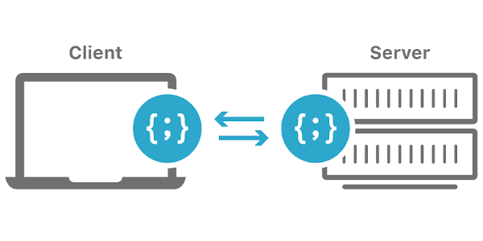

+++
title = "Introduction"
date = 2021-06-17T16:09:58-04:00
weight = 1
chapter = true
+++

# Introduction

Thanks for attending the Jumpstart workshop: **Building Blocks of the Web**. This workshop is meant to help you understand the basic building blocks of a web page. 

There will be a lot of information. You probably won't retain all of it, but that ok. This is meant as a taste to what available in front-end development. Mastering it doesn't happen in a 2½ hour course. 

## What does this workshop assume?

I assume you are eager to learn more about front-end web development. I am aproaching this working assuming you have little if any web development experience. 

## What does this workshop cover?

The Building Blocks of the Web portion of the Jumpstart workshop focuses specifically on **front-end** web development. The front-end is what the user can see, the visual layout and interactivity of a web site. It's built using a combination of technologies such as **Hypertext Markup Language (HTML)**, **JavaScript** and **Cascading Style Sheets (CSS)**.

## What doesn't this workshop cover?

This workshop will not cover the **back-end** or server side languages of web development. Back-end or server-side languages build the infrastruture that supports the front-end. They are rendered on a web server and not by your computer. Server side language are used to dynamically display different data when needed, generally pulled out of a database also stored on the server and sent to the client to be displayed on the front-end via a browser.

You may have heard of programing languages like PHP, Python, Java, or C++ (there's a zillion of them). They are server side programming languages and these will be discussed in the Introduction to Databases & Web Dev Workshop workshop later this week.  

