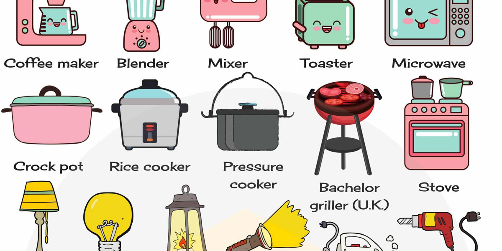

+++
title = "Javascript"
date = 2021-06-17T15:59:10-04:00
weight = 6
chapter = true
+++

# Javascript

## Javascript is like household appliances



Unlike HTML or CSS, Javascript is a programming language. It is used by the browser to manipulate just about any element on a web page. 

## How do we add Javascript to a web page?

###  Internal Javascript

```
<script>

  // JavaScript goes here

</script>
```

### External Javascript

```
<script src="script.js"></script>
```

Like CSS, the best way to include JS is through an external file. The most important reasons for this are:
- Same file can be reused across multiple pages.
- Reduces the amount of code on a single page.
- Allows the browser to cache the file which will speed up future page loads.

### Load the javascrtipt file last

A browser executes as it loads your HTML. If the browser loads a JS file too early in the markup, there's a chance it will misfire and cause an error because your JS may be manipulating elements that haven't been loaded by the browser yet.

A simple way to prevent this is to add the script tag at the end of your html document, just before the closing ```<body>``` tag.

Another option is to wrap your JS in an event listener that will wait until the page has fully loaded before executing any JS, like this:

```
document.addEventListener("DOMContentLoaded", function(event) {
	// your javascript
});
```

## The DOM

Before we get into writing some Javascript we need to understand the Document Object Model or DOM.

When a browser loads a page it puts a representation of the structure of the page's HTML elements into memory. This is the DOM. It is an object-oriented representation of the web page, which can be modified with a scripting language such as JavaScript. Modifying the DOM will change what the user sees when they are viewing your webpage in their browser.

The DOM is not a programming language but a way of interfacing with programming languages. It's an API.

To access the DOM you don't have to do anything specific. It's done by the browser each time a web page loads.
